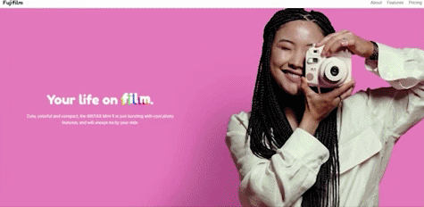
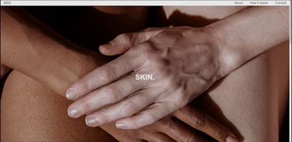

   
   
   
   
   
   
   
   
   
   <!---->

    
  

    
Hi there! I'm <strong>Ana</strong>, a Full-Stack Engineer based in Brazil. Currently looking to expand on my portfolio and always open for collaborations!

    
- 🎓 Recently graduated in Apparel Design

    
- 👩🏻 Pronouns <strong>she/her</strong>

    
- 🖥️ I’m currently working on my personal <strong>portfolio website</strong>

    
- 🌱 I’m currently learning <strong><a href="https://www.freecodecamp.org/learn/javascript-algorithms-and-data-structures/">JavaScript Algorithms and Data Structures</a></strong>

    
- 🐉 Fun fact <strong>I lived in China for two years, so I can speak conversional Mandarin</strong>

  

   
   <h2 align='center'>Projects</h2>
   

      <table>
         <td width="50%">
            <h3 align="center">Fujifilm Instax | Product Landing Page</h3>
            

               
                  
            

               <strong>HTML, CSS </strong>4th certification project assigned by freeCodeCamp as part of Responsive Web Design Curriculum.
            

            

         </td>
         <td width="50%">
            <h3 align="center">freeCodeCamp | A Tribute Page</h3>
            

               
                  
            

               <strong>HTML, CSS </strong>A tribute page to Nise da Silveira, a revolutionary Brazilian psychiatrist and pioneer of rehabilitation psychiatry.
            

            

         </td>
         </tr>
         <tr>
            <td width="50%">
               <h3 align="center">freeCodeCamp | Survey Form</h3>
               

                  
                    
               

                  <strong>HTML, CSS, Pure.css </strong>1st certification project assigned by freeCodeCamp as part of Responsive Web Design Curriculum. Built with Pure.css framework
               

               

            </td>
            <td width="50%">
               <h3 align="center">Scrimba | Basketball Scoreboard</h3>
               

                  
                     
               

                  <strong>HTML, CSS, JavaScript </strong>1st Solo Project from Scrimba's JavaScript Course. A simple web app to help keep score of a basketball match.
               

               

            </td>
         </tr>
      </table>
   

   <h2 align='center'>Technologies</h2>
   <table>
      <tbody>
         <td valign='top' width='33.33%'>
            <h3 align='center'>
            Frontend
            <h3>
            
            
            
            
                                              
         </td>
         <td valign='top' width='33.33%'>
            <h3 align='center'>
            Backend
            <h3>
            
              
         </td>
         <td valign='top' width='33.33%'>
            <h3 align='center'>
            Other softwares
            <h3>
            
            
            
            
             
             
             
             
         </td>
      </tbody>
   </table>