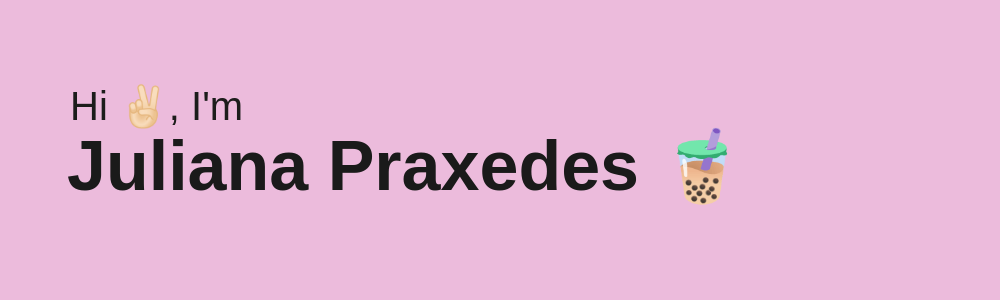
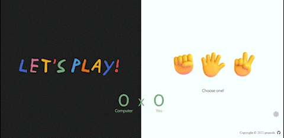
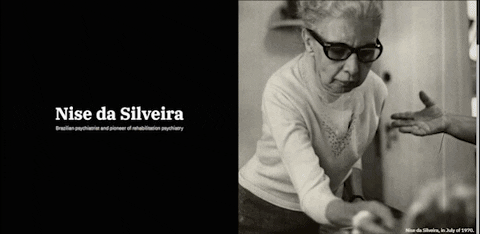
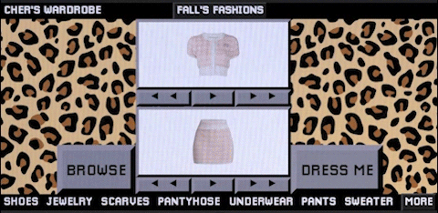
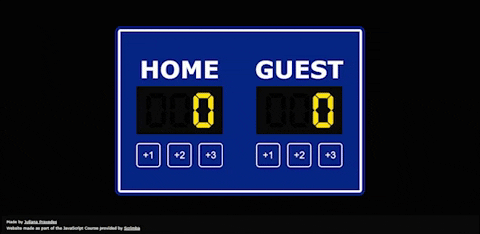

   
   
   
   
   
   
   
   

    
  
  

    
Hi there! I'm <strong>Ana</strong>, a Full-Stack Engineer based in Brazil. Currently looking to expand on my portfolio and always open for collaborations!

    
- 🎓 Majoring in Apparel Design

    
- 👩🏻 Pronouns: <strong>she/her</strong>

<!--     
- 🖥️ I’m currently working on my personal <strong>portfolio website</strong>
 -->
    
- 🌱 Currently focusing on:

     <ul>
        <li><strong><a href="https://www.freecodecamp.org/learn/javascript-algorithms-and-data-structures/" target="_blank">JavaScript Algorithms and Data Structures</a></strong></li>
        <li><strong><a href="https://www.coursera.org/professional-certificates/meta-front-end-developer" target="_blank">Meta Front-End Developer Professional Certificate</a></strong></li>
        <li><strong><a href="https://www.theodinproject.com/paths/full-stack-javascript" target="_blank">The Odin Project's Fullstack JavaScript</a></strong></li>
     </ul>
    
- 🐉 Fun fact: <strong>I lived in China for two years, so I can speak Mandarin (intermediate though 一点点) </strong>

  

   
   <h2>Projects</h2>
   

      <table>
         <td width="50%">
            <h3 align="center">The Odin Project | Rock, Paper, Scissors</h3>
            

               
                  
            

               <strong>HTML, CSS, JavaScript </strong>A simple implementation of the classic “rock paper scissors”. Part of The Odin Project's curriculum.
            

            

         </td>
         <td width="50%">
            <h3 align="center">freeCodeCamp | A Tribute Page</h3>
            

               
                  
            

               <strong>HTML, CSS </strong>A tribute page to Nise da Silveira, a revolutionary Brazilian psychiatrist and pioneer of rehabilitation psychiatry.
            

            

         </td>
         </tr>
         <tr>
            <td width="50%">
               <h3 align="center">CodePen | "Clueless" Cher's Wardrobe</h3>
               

                  
                    
               

                  <strong>HTML, CSS, JavaScript </strong> Remake of Cher's closet scene from the 1995 movie Clueless. Part of Codepen's November 2022 weekly challenges.
               

               

            </td>
            <td width="50%">
               <h3 align="center">Scrimba | Basketball Scoreboard</h3>
               

                  
                     
               

                  <strong>HTML, CSS, JavaScript </strong>1st Solo Project from Scrimba's JavaScript Course. A simple web app to help keep score of a basketball match.
               

               

            </td>
         </tr>
      </table>
   
   <h2 align='center'>Technologies</h2>
   <table>
      <tbody>
         <td valign='top' width='33.33%'>
            <h3 align='center'>
            Frontend
            <h3>
            

              
              
              
              
               
            
                                 
         </td>
         <td valign='top' width='33.33%'>
            <h3 align='center'>
            Backend
            <h3>
            

              
                
            

         </td>
         <td valign='top' width='33.33%'>
            <h3 align='center'>
            Other softwares
            <h3>
            

              
              
              
              
               
               
               
              
            
 
         </td>
      </tbody>
   </table>

