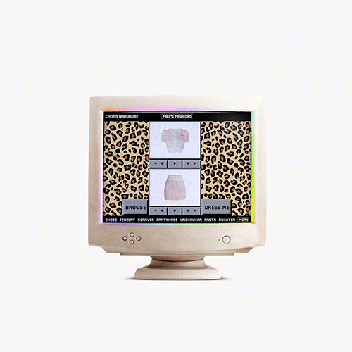
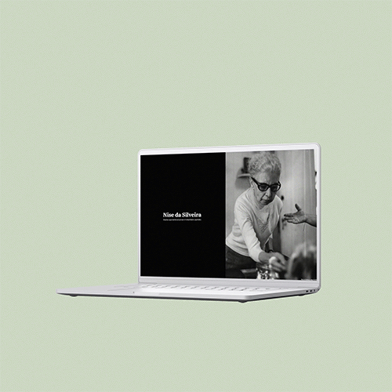

   
   
<!--     -->
   
   
   

<!--
  

    
Hi there! I'm <strong>Ana</strong>, a Full-Stack Software Developer based in Brazil.

    
- 🎓 Majoring in Apparel Design;

    
- 👩🏻 Pronouns: <strong>she/her</strong>;

    
- 🖥️ I’m currently working on/projects in development:

    
- 🌱 Currently focusing on:

     <ul>
        <li><strong><a href="https://www.freecodecamp.org/learn/back-end-development-and-apis/" target="_blank">Back End Development and APIs</a></strong></li>
        <li><strong><a href="https://www.coursera.org/professional-certificates/meta-back-end-developer" target="_blank">Meta Back-End Developer Professional Certificate</a></strong>
            <ul><li><a href="https://www.coursera.org/learn/programming-in-python" target="_blank">Programming in Python</a></li></ul>
        </li>
        <li><strong><a href="https://www.coursera.org/professional-certificates/meta-front-end-developer" target="_blank">Meta Front-End Developer Professional Certificate</a></strong>
            <ul><li><a href="https://www.coursera.org/learn/advanced-react" target="_blank">Front-End Developer Capstone</a></li></ul>
        </li>
     </ul>
  

   
   <h2>Projects</h2>
   

      <table>
         <td width="50%">
            <h3 align="center">Clueless | Cher's Closet</h3>
            

               
                  
            

               <strong>HTML, CSS, JavaScript </strong>A Remake of Cher's closet scene from the 1995 movie Clueless.
            

            

         </td>
         <td width="50%">
            <h3 align="center">freeCodeCamp | A Tribute Page</h3>
            

               
                  
            

               <strong>HTML, CSS </strong>A tribute page to Nise da Silveira, a revolutionary Brazilian psychiatrist and pioneer of rehabilitation psychiatry.
            

            

         </td>
         </tr>
         <tr>
            <td width="50%">
               <h3 align="center">TOP | Rock Paper Scissors</h3>
               

                  
                    
               

                  <strong>HTML, CSS, JavaScript </strong> A simple implementation of grade-school classic “rock paper scissors” using vanilla Javascript.
               

               

            </td>
            <td width="50%">
               <h3 align="center">TOP | Calculator</h3>
               

                  
                     
               

                  <strong>HTML, CSS, JavaScript </strong>On-screen calculator built using JavaScript, HTML, and CSS.
               

               

            </td>
         </tr>
      </table>

    
   
   <h2 align='center'>Technologies</h2>
   <table>
      <tbody>
         <td valign='top' width='33.33%'>
            <h3 align='center'>
            Backend
            <h3>
            

              
                
            

         </td>
         <td valign='top' width='33.33%'>
            <h3 align='center'>
            Frontend
            <h3>
            

              
              
              
              
               
               
            
                                 
         </td>
         <td valign='top' width='33.33%'>
            <h3 align='center'>
            Other softwares
            <h3>
            

              
              
              
            
 
         </td>
      </tbody>
   </table>

 

-->
