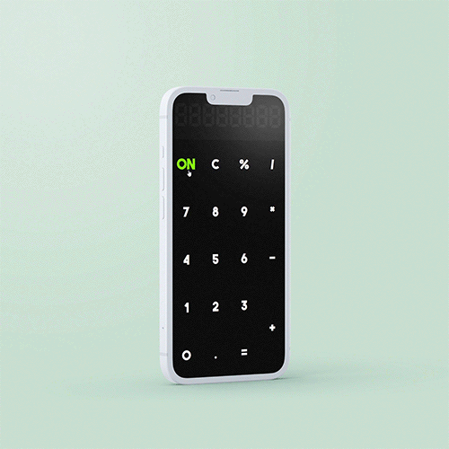

   
   
   
   
   
   

  

    
Hi there! I'm <strong>Juliana Praxedes</strong>, an Elixir Developer based in Taichung.

    
- 🎓 Academic background in Fashion Design;

    
- 👩🏻 Pronouns: <strong>she/her</strong>;

    
- 🌱 Currently focusing on:

     <ul>
        <li><strong><a href="https://www.freecodecamp.org/learn/relational-database" target="_blank">FreeCodeCamp's Relational Database Certification</a></strong></li>
     </ul>
  

  <!--  
   <h2>Projects</h2>
   

      <table>
         <td width="50%">
            <h3 align="center">Clueless | Cher's Closet</h3>
            

               
                  
            

               <strong>HTML, CSS, JavaScript </strong>A Remake of Cher's closet scene from the 1995 movie Clueless.
            

            

         </td>
         <td width="50%">
            <h3 align="center">freeCodeCamp | A Tribute Page</h3>
            

               
                  
            

               <strong>HTML, CSS </strong>A tribute page to Nise da Silveira, a revolutionary Brazilian psychiatrist and pioneer of rehabilitation psychiatry.
            

            

         </td>
         </tr>
         <tr>
            <td width="50%">
               <h3 align="center">TOP | Rock Paper Scissors</h3>
               

                  
                    
               

                  <strong>HTML, CSS, JavaScript </strong> A simple implementation of grade-school classic “rock paper scissors” using vanilla Javascript.
               

               

            </td>
            <td width="50%">
               <h3 align="center">TOP | Calculator</h3>
               

                  
                     
               

                  <strong>HTML, CSS, JavaScript </strong>On-screen calculator built using JavaScript, HTML, and CSS.
               

               

            </td>
         </tr>
      </table>
     -->

